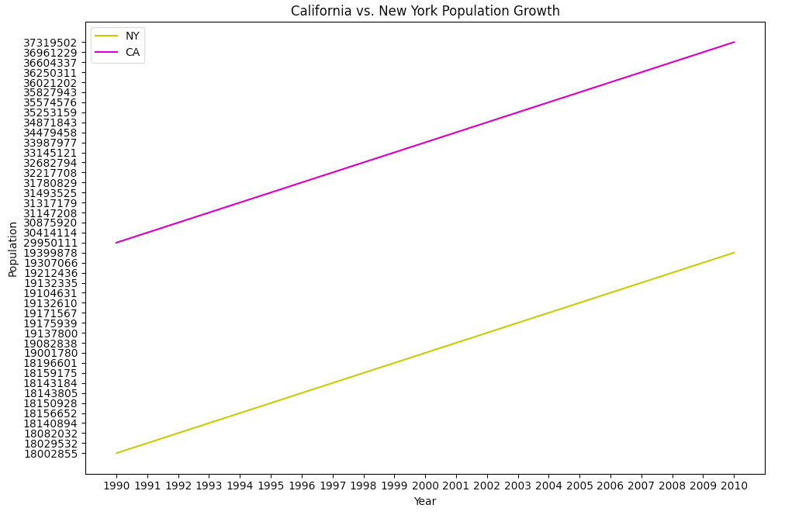
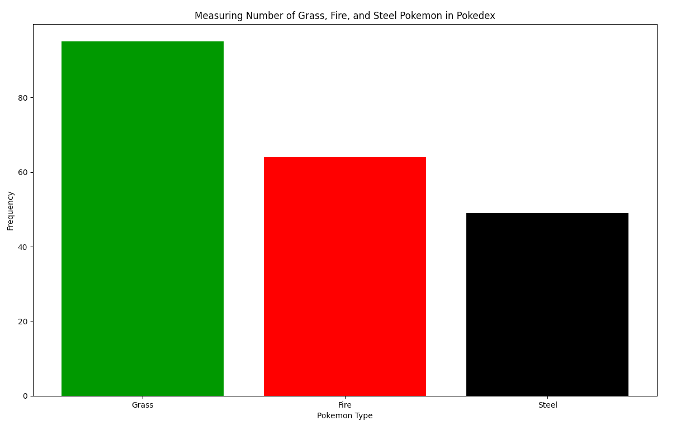

# HW02 - State Population
## State Population Growth for CA and NY

For my first graph, I wanted to compare population growth between CA and NY over a span of 20 years. I chose this duration for two reasons. First, I thought it'd be interesting to focus on a duration that had some time before I was born and sometime after I was born. I cover from 1990(10 years before I was born) and 2010(10 years after) just to personalize it a little more. The second reason is that I know CA starting picking up in population around the 90's and was interested to see just how much it had grown in a span of 20 years. I included my csv of the data and it can also be found [here.](https://github.com/JoshData/historical-state-population-csv/blob/primary/historical_state_population_by_year.csv)

## Pokedex Data for Grass, Fire, and Steel

For my second graph, I wanted to see how many pokemon there are in the pokedex for the following types:grass, fire, and steel. I counted the number of each type in the pokedex and then created a bar graph to show the frequencies. I was also able to fill in the bar graphs with a different color to match the type. I included my csv file but the data can also be found here [here.](https://gist.github.com/armgilles/194bcff35001e7eb53a2a8b441e8b2c6#file-pokemon-csv)

Lastly, in case you need a refresher of how to do this assignment, here is the [link.](https://github.com/mikeizbicki/cmc-csci040/tree/2021fall/hw_02)
